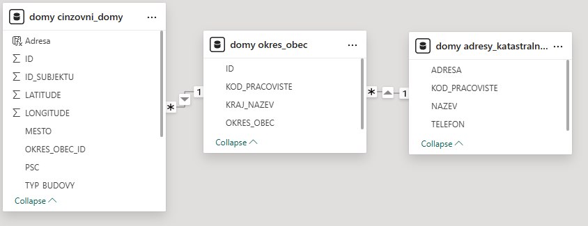

# Satpo interview - Jan Vaník

## Úkol 1
### 1.1 Návrh datového modelu

Pro relační vztahy jsem vybral tabulku činžovní domy, protože mi přišla zajímavější. V tabulce činžovních domů je nově sloupec "OKRES_OBEC_ID", který linkuje tabulku cinzovni_domy na tabulku okres_obec. 

Volba sloupce okres_obec byla dána tím, že v ČR existuje více obcí se stejným názvem v různých okresech, identifikátor okres_obec by tím pádem měl být jedinečný, vzniká zkrátka spojením názvu okresu a obce spojovníkem.

Tabulka okres_obec je pak linkována sloupcem "KOD_PRACOVISTE" na adresy_katastralnich_uradu, "KOD_PRACOVISTE" byl zachován podle číselníků.

### 1.2 Návrh procesu importu

Import sestává ze dvou částí

- init.py

Skript smaže veškeré tabulky z databáze a vytvoří nové, zároveň zpracuje data z číselníků a doplní je do tabulek okres_obec a adresy_katastralnich_uradu.

- process.py

Skript vezme data z tabulky cinzdomy.xlsx a vyplní jimi tabulku cinzovni_domy.

### 1.3 Počítání s aktualizací dat

Při změně dat lze opakovaně pustit skript process.py znovu a pro stejné ID domu se data aktualizují.

### SQL
Jsou uloženy v souboru queries.py.

## Úkol 2
Report je uložen v souboru 